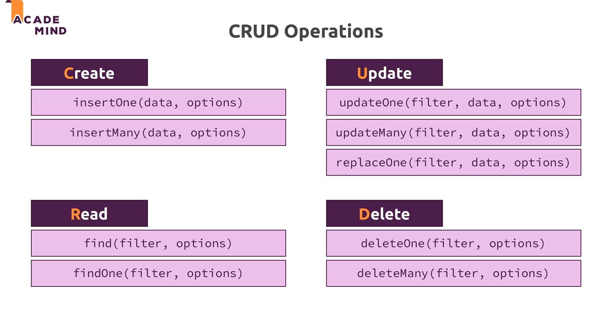

CRUD (Create, Read, Update, Delete) operations are fundamental operations for working with data in MongoDB. Below are the commonly used MongoDB commands and methods for performing CRUD operations:



### Create (Insert) Data:

1. **Insert a Single Document**:

   ```javascript
   db.collectionName.insertOne({ key: "value" });
   ```

2. **Insert Multiple Documents**:
   ```javascript
   db.collectionName.insertMany([
     { key1: "value1" },
     { key2: "value2" },
     // More documents
   ]);
   ```

### Read (Query) Data:

3. **Find Documents**:

   ```javascript
   db.collectionName.find({ key: "value" });
   ```

4. **Find All Documents**:

   ```javascript
   db.collectionName.find({});
   ```

5. **Limit Results (e.g., First 10 Documents)**:

   ```javascript
   db.collectionName.find({}).limit(10);
   ```

6. **Projection (Select Specific Fields)**:

   ```javascript
   db.collectionName.find({}, { key1: 1, key2: 1, _id: 0 });
   ```

7. **Sorting (Ascending or Descending)**:

   ```javascript
   db.collectionName.find({}).sort({ key: 1 }); // Ascending
   db.collectionName.find({}).sort({ key: -1 }); // Descending
   ```

8. **Count Documents**:
   ```javascript
   db.collectionName.find({ key: "value" }).count();
   ```

### Update Data:

9. **Update a Single Document**:

   ```javascript
   db.collectionName.updateOne({ filter }, { $set: { key: "new value" } });
   ```

10. **Update Multiple Documents**:

    ```javascript
    db.collectionName.updateMany({ filter }, { $set: { key: "new value" } });
    ```

11. **Replace a Document**:
    ```javascript
    db.collectionName.replaceOne({ filter }, { newDocument });
    ```

### Delete Data:

12. **Delete a Single Document**:

    ```javascript
    db.collectionName.deleteOne({ filter });
    ```

13. **Delete Multiple Documents**:

    ```javascript
    db.collectionName.deleteMany({ filter });
    ```

14. **Delete All Documents in a Collection**:
    ```javascript
    db.collectionName.deleteMany({});
    ```

These are the basic CRUD operations in MongoDB. The `db` object refers to the current database you are using in the MongoDB shell, and `collectionName` should be replaced with the actual name of your collection. For more complex queries and operations, you can use MongoDB's powerful query and aggregation capabilities. Additionally, many MongoDB drivers in different programming languages provide methods for performing these operations programmatically.
